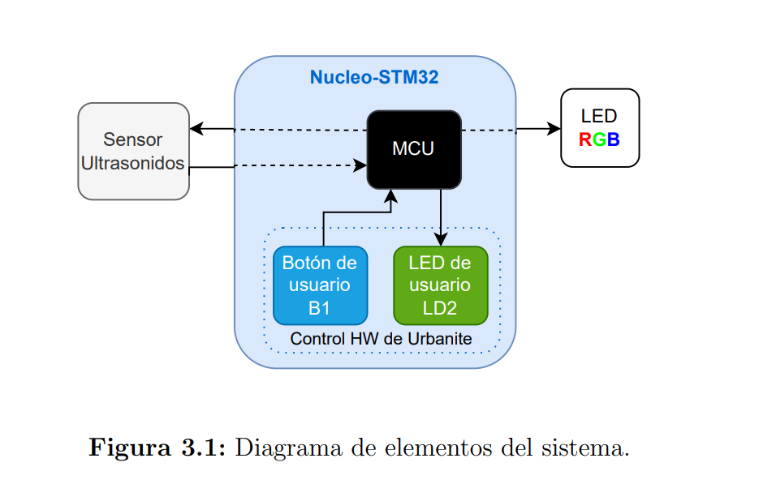
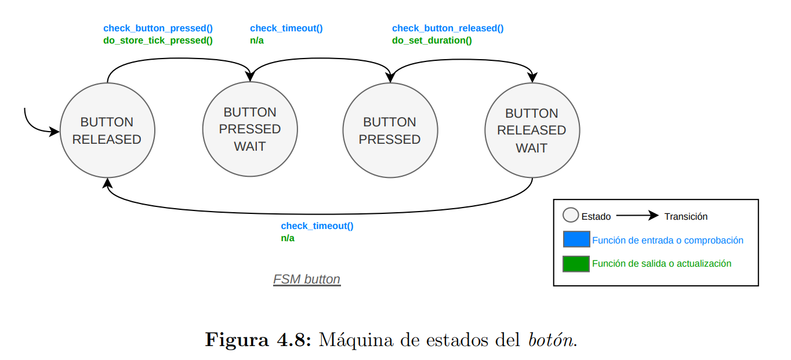
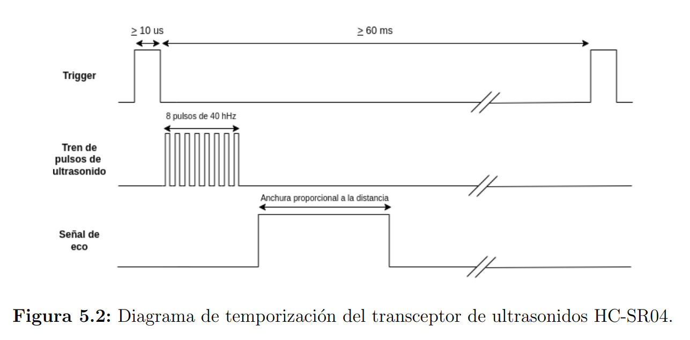
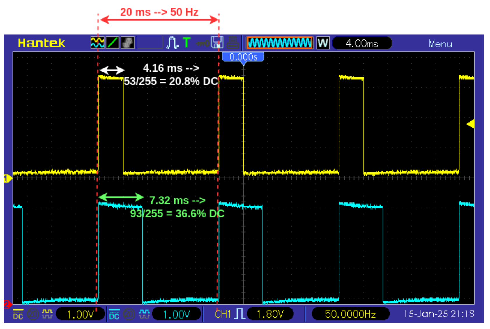
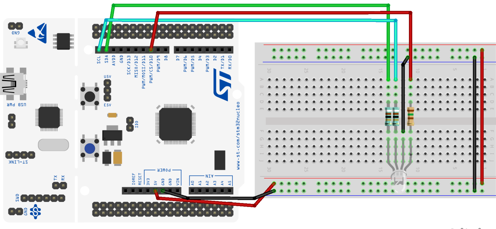
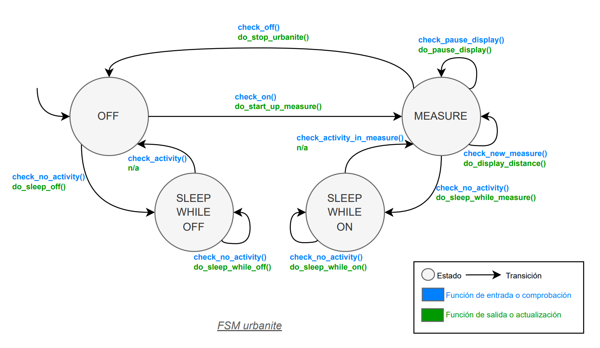
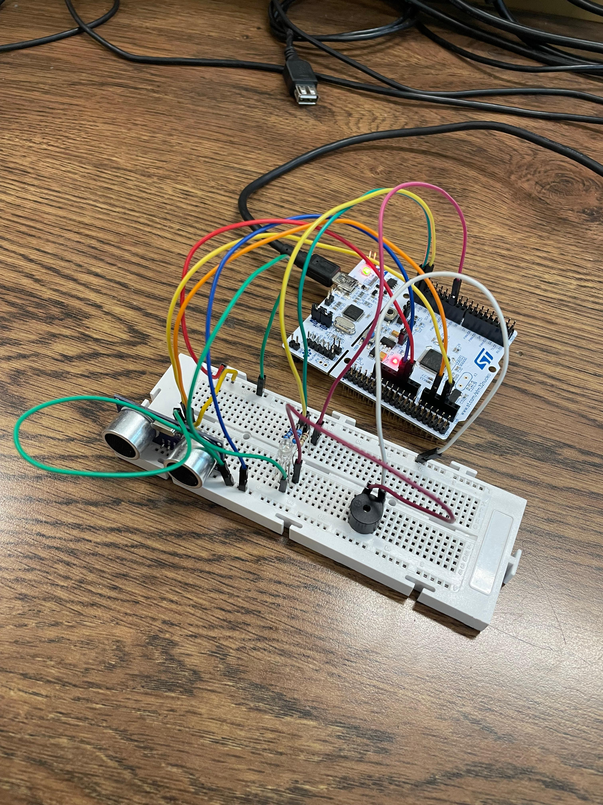
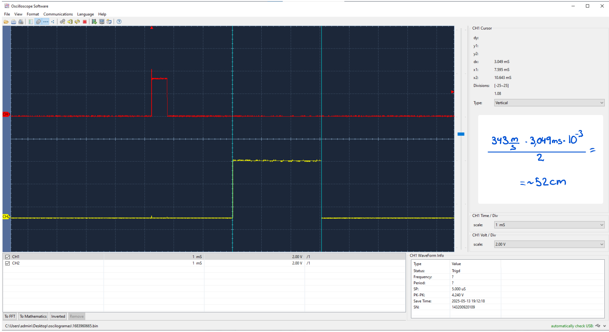
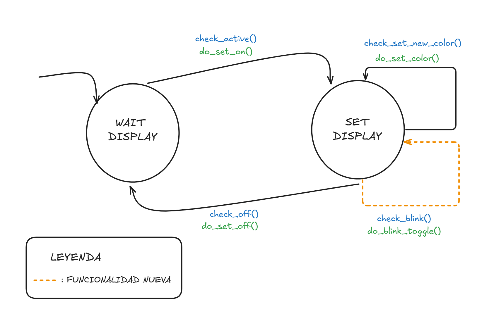
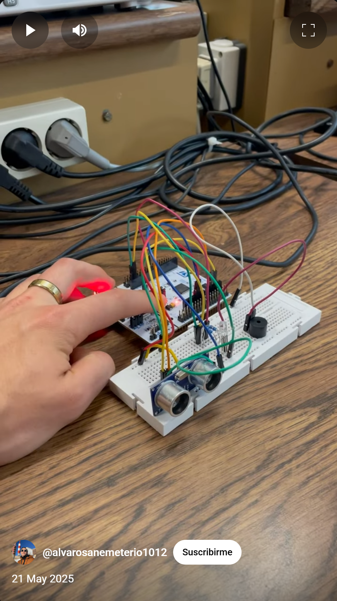

# Urbanite: Sistema de Ayuda al Aparcamiento Basado en Ultrasonidos

## Authors

* **Álvaro San Emeterio Valdés** - email: [a.sanemeterio@alumnos.upm.es](mailto:a.sanemeterio@alumnos.upm.es)
* **Alejandro Barrio Domínguez** - email: [alejandro.barrio.dominguez@alumno.es](mailto:alejandro.barrio.dominguez@alumno.es)

## Descripción del proyecto

**Urbanite** es un sistema empotrado desarrollado sobre la plataforma Nucleo-STM32F446RE que permite detectar la distancia a obstáculos utilizando un sensor de ultrasonidos HC-SR04. Esta información se muestra al usuario mediante un LED RGB, y se controla el funcionamiento mediante un botón físico. El sistema está implementado en lenguaje C y sigue una arquitectura modular basada en máquinas de estados finitos (FSM) y principios de programación portable y reutilizable.

## Diagrama del proyecto

> El sistema central con la placa Nucleo-STM32 aloja el microcontrolador STM32F446RE. Se encarga de gestionar el encendido y apagado del sistema Urbanite, y de interpretar la distancia para actuar en consecuencia.

> La placa Nucleo-STM32 también tiene el botón de usuario B1, y el LED de usuario LD2. Estos conforman el sub-sistema de control básico. El botón se usará para detectar pulsaciones que el sistema central interpretará para encender/apagar o pausar el display. El LED podrá usarse para saber si hemos realizado correctamente una operación, a modo de feedback.

> El sub-sistema de medida de distancia representa un dispositivo HW que incorpora un transceptor de ultrasonidos HC-SR04. Este dispositivo contiene un altavoz que emite un pulso ultrasónico y un micrófono que recoge el eco. La distancia a la que se encuentra un obstáculo se puede calcular a partir del tiempo que tarda en llegar el eco.

> El módulo de actuación está compuesto por un LED RGB que se encenderá en función de la distancia.

---

## Version 1 - Botón de usuario

### Descripción general

Esta versión implementa el control básico del sistema mediante un botón de usuario (PC13). Se usa para encender, apagar y pausar el sistema Urbanite. Se emplea una máquina de estados finita (FSM) para gestionar los estados del botón y se aplica lógica anti-rebote por software.

### Funcionalidad implementada

- Lectura del botón mediante interrupciones (EXTI13).
- FSM para detección de pulsación y duración.
- Gestión del estado del sistema según duración de la pulsación.
- Temporización con SysTick.
- Tests unitarios para parte `PORT` y `COMMON`.
- Documentación generada con Doxygen.

### Estructura modular

- **PORT**: acceso al hardware del botón.
- **COMMON**: lógica genérica y FSM del botón.

### Diagrama de estados FSM BUTTON

---

## Version 2 - Transceptor de ultrasonidos

### Descripción general

En esta versión se implementa la librería para el sensor de ultrasonidos HC-SR04. Se emplean tres temporizadores (TIM2, TIM3, TIM5) para gestionar respectivamente:
- El pulso de trigger.
- La medida de la señal de eco (input capture).
- El timeout entre mediciones.

### Funcionalidad implementada

- Configuración del trigger por temporizador.
- Medición de eco con input capture.
- Temporizador de timeout entre medidas.
- FSM para gestionar el ciclo de medida.
- Tests unitarios para las tres señales (trigger, echo y timeout).

### Estructura modular

- **PORT**:
  - Control del pin de trigger.
  - Lectura del pin de echo (input capture).
  - Configuración de temporizadores.
- **COMMON**:
  - FSM que controla el ciclo de medida.
  - Cálculo de distancia con fórmula estándar.

### Diagrama Trigger/Echo

---

## Version 3 - Display RGB

### Descripción general

En esta versión se implementa el subsistema de actuación mediante un LED RGB de cátodo común. Se emplean temporizadores configurados en modo PWM (Pulse Width Modulation) para controlar la intensidad de cada uno de los tres colores (Rojo, Verde, Azul), permitiendo generar colores combinados en función de la distancia detectada.

Se utiliza una FSM para gestionar la visualización de colores de forma escalonada según la distancia.

### Funcionalidad implementada

- Generación de señales PWM mediante timers hardware.
- Control de la intensidad de los colores RGB mediante modulación de ciclo de trabajo.
- Gestión de visualización según distancia medida.
- Test unitarios para la librería de control del LED RGB.
- Documentación generada con Doxygen.

### Estructura modular

- **PORT**:
  - Configuración de los timers PWM.
  - Control del duty cycle para cada color.
- **COMMON**:
  - FSM de visualización en función de la distancia.
  - Lógica de encendido/apagado de colores.

### Diagrama de señales PWM

> Ejemplo de cómo varían las señales PWM para generar colores compuestos en el LED RGB.

### Montaje del LED RGB

> Fotografía o esquema del montaje del LED RGB con resistencias conectado a la placa Nucleo.

---

## Version 4 - Modos de bajo consumo e integración final

### Descripción general

En esta versión se integra todo el sistema Urbanite completo: control por botón, medición de distancia mediante ultrasonidos y visualización mediante el display RGB. Se implementan modos de bajo consumo para optimizar el gasto energético cuando el sistema no está activo.

Se desarrolla una FSM principal que coordina todos los subsistemas anteriores.

### Funcionalidad implementada

- Integración de las FSM de botón, sensor de ultrasonidos y display RGB en una única FSM de sistema.
- Implementación de modos de bajo consumo (Stop Mode y Sleep Mode) para reducir el consumo energético.
- Gestión del encendido, apagado y pausa del sistema de forma centralizada.
- Reanudación correcta del sistema tras despertar de modo de bajo consumo.
- Test de integración para verificar el correcto funcionamiento de todo el sistema.

### Estructura modular

- **PORT**:
  - Configuración de modos de bajo consumo.
- **COMMON**:
  - FSM principal del sistema Urbanite que coordina las FSM individuales de cada subsistema.

### Diagrama de la FSM Urbanite

> Diagrama de la FSM que integra los modos ON, OFF, PAUSE y modos de bajo consumo.

### Montaje final

> Imagen para mostrar el montaje real del sistema

### Captura osciloscopio

> En esta imagen podemos observar el cálculo real de la distancia obtenida sobre uno de los osciloscopios del laboratorio

---

## Version 5.1 - Parpadeo del LED RGB

### Descripción general

En esta versión se añade una mejora visual al sistema Urbanite: el LED RGB no solo cambia de color en función de la distancia al obstáculo, sino que **también parpadea a diferentes frecuencias dependiendo de dicha distancia**. Esta funcionalidad adicional permite ofrecer una respuesta visual más intuitiva y accesible al usuario, incrementando la percepción del riesgo cuanto más cerca se encuentre el obstáculo.

Se mantiene la arquitectura modular basada en FSM, incorporando la lógica de parpadeo en la máquina de estados del display (`fsm_display`). El periodo de parpadeo se calcula automáticamente cada vez que se actualiza la distancia, y el parpadeo se ejecuta de forma periódica mediante temporización basada en `SysTick`.

### Funcionalidad implementada

- Incorporación de lógica de parpadeo en la FSM del display.
- Selección automática del periodo de parpadeo según el rango de distancia:
  - Distancia muy próxima → parpadeo rápido.
  - Distancia media → parpadeo moderado.
  - Distancias seguras → sin parpadeo.
- Alternancia automática del estado ON/OFF del LED mediante función `port_display_toggle_rgb()`.
- Ampliación de la estructura interna del display con campos de temporización (`toggle_period_ms`, `next_toggle_time`).
- Transición adicional en la FSM que gestiona el parpadeo mientras el sistema está activo.
- Comprobación del tiempo de toggle en cada ciclo de la FSM.

### Estructura modular

- **PORT**:
  - Se implementa la nueva función `port_display_toggle_rgb()`, que permite alternar el estado del LED RGB entre encendido (último color aplicado) y apagado. Esto permite simular el parpadeo sin necesidad de volver a calcular el color desde cero.
  - Para ello, se añaden dos nuevas variables globales:
    - `current_color[]`, que guarda el último color asignado a cada display.
    - `led_on[]`, que mantiene el estado actual (ON/OFF) del LED.
  - Además, se modifica la función `port_display_set_rgb()` para actualizar estas variables cada vez que se aplica un nuevo color. Todo esto se hace sin afectar al funcionamiento previo del sistema.

- **COMMON**:
  - Se amplía la estructura interna de la FSM del display (`fsm_display_t`) con dos nuevos campos:
    - `toggle_period_ms`: guarda el intervalo de parpadeo en milisegundos.
    - `next_toggle_time`: almacena el tiempo absoluto en el que debe producirse el siguiente cambio de estado del LED.
  - En la función `fsm_display_set_distance()`, que ya se ejecuta cada vez que se recibe una nueva medida del sensor ultrasónico, se añade lógica para asignar automáticamente un periodo de parpadeo según el rango de distancia.
  - Se incorpora una nueva condición `check_blink()` y una acción `do_blink_toggle()` a la tabla de transiciones de la FSM. Esta transición verifica si ha transcurrido el tiempo de espera para el siguiente toggle y, si es así, llama a la función `port_display_toggle_rgb()`.
  - De este modo, mientras el sistema está activo (`SET_DISPLAY`), la FSM del display evalúa de forma periódica si debe alternar el estado del LED, generando así el efecto de parpadeo con la frecuencia deseada.

### Máquina de estaods actualizada

> Ejemplo ilustrativo de la relación entre la distancia medida y la frecuencia de parpadeo del LED RGB.

### Valores de ejemplo para parpadeo

| Rango de distancia (cm) | Color del LED              | Frecuencia de parpadeo  |
|-------------------------|----------------------------|--------------------------|
| 0 – 25                  | Rojo                       | 10 Hz (100 ms toggle)    |
| 26 – 50                 | Amarillo                   | 3.3 Hz (300 ms toggle)   |
| > 50                    | Verde / Turquesa / Azul    | Sin parpadeo             |

## Version 5.2 - Activación sonora mediante buzzer pasivo

### Descripción general

Durante las pruebas del sistema Urbanite, se ha descubierto una mejora funcional adicional que permite añadir una **alerta sonora pasiva**. La mejora consiste en conectar un **buzzer pasivo** al mismo pin que controla el **canal rojo del LED RGB**.

De este modo, el buzzer aprovecha la señal PWM generada por el temporizador asociado al canal rojo. Cuanto más alto es el valor del canal rojo (es decir, cuanto más “rojo” es el color mostrado por el LED), mayor es la intensidad de la señal enviada al buzzer, y por tanto **más fuerte será el sonido emitido**.

Esto proporciona al usuario una señal sonora proporcional a la peligrosidad del entorno:
- **Cuando el LED está completamente rojo (distancia crítica)**, el buzzer emite un tono más agudo
- **Cuando el LED es amarillo (advertencia)**, el buzzer suena más débil.
- **Cuando el LED es verde o azul**, el buzzer no suena (al no haber componente roja).

- **Cuando el LED es turquesa**, debido al color escogido, el turquesa tiene una componenete muy pequeña de rojo, lo cual hace sonar levemente el buzzer siendo así capaces de distinguir más facilmente entre azul y turquesa. Una posible solución sería cambiar el patrón de colores para evitar el turquesa o cualquier color con componente roja para mejorar la implementacion de este buzzer.

### Funcionamiento

Esta mejora aprovecha el hecho de que:
- El LED RGB es controlado por PWM.
- El canal rojo utiliza una señal que puede ser compartida con otros periféricos.
- El buzzer pasivo responde directamente a la señal de modulación del pin.

### Beneficios

- Añade una señal sonora.
- Incrementa la accesibilidad del sistema para personas con dificultades visuales.
- Proporciona una segunda capa de información sensorial (sonido + luz).
- No interfiere con el funcionamiento visual del LED RGB.

> El buzzer se conecta en paralelo con el canal rojo del LED RGB. Cuanto mayor sea el componente rojo del color, más fuerte será el sonido.

### Video demostración sistema completo (pinchar en la imagen)

> Video del sistema completo con las nuevas funcionalidades
---
## Recursos adicionales

- [Documentación generada con Doxygen](docs/html/index.html)
- [Repositorio oficial Urbanite - UPM](https://github.com/sdg2DieUpm/urbanite)
- [Tutoriales y vídeos SDG2](https://www.youtube.com/channel/UCYIw_gl745WMJ1n0MamDzQw)

---

## Licencia

Este proyecto está basado en material docente de la Universidad Politécnica de Madrid (UPM).  
**No está permitida la venta o distribución sin autorización de los autores.**

---

